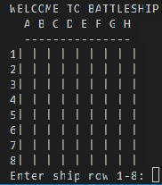
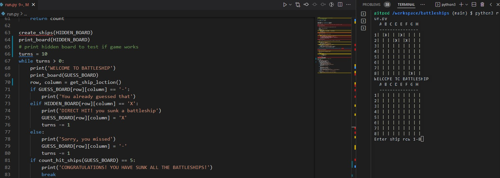

# BATTLESHIPS

This Battleship game is a Python terminal Game, which runs in the Code Institutemock terminal on Heroku.

Users can try and beat the computer by finding the computers hidden battleship before their shot(turns) have run out.
Each battleship occupies one(-) on the board. The user selcts a row number and column letter to target their shot.
A direct hit destroys 1 of 5 Battleships and and a turn is taken. If they miss they they still loose a turn and a chance to win the game.
when all 5 ships have sunk the user will win the game.

here iss a live version of the Python terminal game Battleship: **here iss a live version pf my project**
//insert multi device image of code //

## User Story

We want to create an interactive guessing game written in Python where the user can choose where a battle ship may be hidden and attack it.
The challenge is that they only have a limited amount of turns in order to find all the hidden battle ships
* First we would need to create two boards. 
** One would be hidden with the randomly delected 5 ships marked on the board.
** The second would be visable and blank for the user to show were he has previously attached and where they have sunk battleships.

* The user would then be prompted to input a row and a number for the co-ordinates of where they would like to stike
** If it is a 'Direct Hit' where the user has selected the exact location of the randomaly generated location an 'X' will be marked on the visable bpard and -1 turn will be taken away from their total turns
** If the user has 'Missed' their target a '0' will be marked on the visable board 

## User Story Testing
* While testing if the games works, I chose to print() the hidden board so that I could see exaclt where the computer had randomly selected to put the battleships.

* When selecting the row and number for the co-ordinate of the attack we need to create a while not in statement to specify that only the numbers and letters in this range can be chosen otherwise the code cannot run because the location would not exist. 
* We also need to ensure that if the same location is inputed that it does not deduct a turn twice and the user is prompted to chosse a different location.
## How to Play
The user is prompted with a choice of row and number to select coordinates to attack on the battle ground.
They cannot see where the ships are hiding but make a choice on where to attack. 
If they miss the battle ship the board will mark a '0' and if they hit their target the board will mark an 'X'.
they are only allocated a limited amount of turns to make their choices to make it harder to find all the ships.
If their turns run out before they find all the ships, they loose and the game will start again.
If they find all 5 before their turns run out, they will then win the game.
## Features
### Exisiting Features
* 
** 

## Testing

## Bugs
If a user inputs nothing and enters their row and column no input error arrises but after the input returns an error displayed in the terminal

## Validator Testing
* PEP8
**

## Constraints

The deployment terminal is set to 80 columns by 24 rows. That means that each line of text needs to be 80 characters or less otherwise it will be wrapped onto a second line.

## Deployment
This project was deplyed using Code Institue's mock terminal fo rHeroku.

* Steps for deployment:

** Clone the repository 
** Create a new Heroku app
When you create the app, you will need to add two buildpacks from the _Settings_ tab. The ordering is as follows:

1. `heroku/python`
2. `heroku/nodejs`

You must then create a _Config Var_ called `PORT`. Set this to `8000`
** Set the buildbacks to Python and NodeJS in that order
** Link the Heroku appto the repository
** Click on Deploy

## Credits 
* Code Institue for the deployment terminal
* Code Institue 'Sample README.md file' 
//**  https://learn.codeinstitute.net/courses/course-v1:CodeInstitute+PE_PAGPPF+2021_Q2/courseware/b3378fc1159e43e3b70916fdefdfae51/605f34e006594dc4ae19f5e60ec75e2e/ ***////
* Wikipedia for details of the Battleship game
* 'guachilimbo' an examply of Python code of Battleship played in the terminal
///// **** https://github.com/guachilimbo/battleship/blob/main/Battleship.py   ****//////

